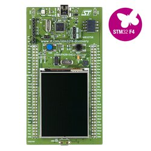

# STM32F429Discovery DTS and Peripheral Configuration Guide

This document provides guidelines for configuring **Device Tree Source (DTS)** files and Linux kernel settings for **I2C**, **SPI**, and **PWM** interfaces on the **STM32F429Discovery** board. It also includes a troubleshooting checklist to analyze device initialization, driver bindings, and runtime issues.

## Board Overview

The **STM32F429I-DISC1** board is equipped with:

ST-LINK/V2-B embedded debugger/programmer

- 2.4" QVGA TFT LCD
- External 64-Mbit SDRAM
- ST MEMS gyroscope
- USB OTG micro-AB connector
- Onboard LEDs and push-buttons



### Pinout Legend


References: [mbed: Boards » DISCO-F429ZI](https://os.mbed.com/platforms/ST-Discovery-F429ZI/)


## Directory Structure

Device tree and related files are typically organized as follows:

```
firmware/
├── board/stm32f429disco/
│   ├── dts/                        ← Custom Device Tree files
│   │   ├── stm32f429disco-custom.dts
│   │   ├── overlays/               ← Optional DT overlays for peripherals
│   │   └── README.md               ← This file
│   ├── linux.config                ← Kernel configuration
│   ├── defconfigs/                 ← Buildroot configurations
│   ├── linux-patches/              ← Custom kernel patches
│   └── rootfs-overlay/             ← Root filesystem overlay
└── ...
```

## Modifying Linux Device-Tree in Buildroot

After the Modification is done, we have to tell the Buildroot to re-compile the Linux Kernel  
In the Buildroot directory run following command: 
$ make linux-rebuild 
Now we are ready to re-generate the full system image after rebuilding the kernel: 
$ make 


Reference: https://microchip.my.site.com/s/article/Modifying-Linux-Device-Tree-in-Buildroot

## Configuring I2C

### Device Tree (stm32f429disco-custom.dts)

The STM32F429Discovery board features `I2C3`, used by default for the touchscreen controller (STMPE811). An example configuration snippet is provided below:

```dts
&i2c3 {
	pinctrl-names = "default";
	pinctrl-0 = <&i2c3_pins>;
	clock-frequency = <100000>;
	status = "okay";

	stmpe811@41 {
		compatible = "st,stmpe811";
		reg = <0x41>;
		interrupts = <15 IRQ_TYPE_EDGE_FALLING>;
		interrupt-parent = <&gpioa>;
		/* 3.25 MHz ADC clock speed */
		st,adc-freq = <1>;
		/* 12-bit ADC */
		st,mod-12b = <1>;
		/* internal ADC reference */
		st,ref-sel = <0>;
		/* ADC converstion time: 80 clocks */
		st,sample-time = <4>;

		stmpe_touchscreen {
			compatible = "st,stmpe-ts";
			/* 8 sample average control */
			st,ave-ctrl = <3>;
			/* 7 length fractional part in z */
			st,fraction-z = <7>;
			/*
			 * 50 mA typical 80 mA max touchscreen drivers
			 * current limit value
			 */
			st,i-drive = <1>;
			/* 1 ms panel driver settling time */
			st,settling = <3>;
			/* 5 ms touch detect interrupt delay */
			st,touch-det-delay = <5>;
		};

		stmpe_adc {
			compatible = "st,stmpe-adc";
			/* forbid to use ADC channels 3-0 (touch) */
			st,norequest-mask = <0x0F>;
		};
	};
};
```

- `&i2c3` → refers to the third I2C controller of the SoC.
- `reg = <0x41>` → device address on the bus.
- Pull-up resistors on SDA and SCL lines are mandatory for proper operation.


### Kernel Configuration (linux.config)

Enable the following options to ensure `I2C` support:

```
Device Drivers  --->
    [*] I2C support  --->            (CONFIG_I2C=y)
        <*> I2C device interface     (CONFIG_I2C_CHARDEV=y)
        <*> STM32 I2C controller     (CONFIG_I2C_STM32F4=y)
```

## Configuring SPI

### Device Tree (stm32f429disco-custom.dts)

> **Note**: The `"rohm,dh2228fv"` compatible string provides a `/dev/spidevX.Y` device if no dedicated driver is available.

```
&spi5 {
	status = "okay";
	pinctrl-0 = <&spi5_pins>;
	pinctrl-names = "default";
	#address-cells = <1>;
	#size-cells = <0>;
	cs-gpios = <&gpioc 1 GPIO_ACTIVE_LOW>, <&gpioc 2 GPIO_ACTIVE_LOW>;
    
	l3gd20: l3gd20@0 {
		/* Note: Order of compatible strings matters! Uses L3GD20 driver if available, otherwise spidev ("rohm,dh2228fv")  fallback */
		compatible = "st,l3gd20-gyro", "rohm,dh2228fv";
		/* The spidev driver ignores any unknown properties in the DT node. */
		spi-max-frequency = <1000000>;
		st,drdy-int-pin = <2>;
		interrupt-parent = <&gpioa>;
		interrupts = <1 IRQ_TYPE_EDGE_RISING>,
				<2 IRQ_TYPE_EDGE_RISING>;
		reg = <0>;
		status = "okay";
	};

	display: display@1{
		/* Connect panel-ilitek-9341 to ltdc */
		compatible = "st,sf-tc240t-9370-t", "ilitek,ili9341";
		reg = <1>;
		spi-3wire;
		spi-max-frequency = <10000000>;
		dc-gpios = <&gpiod 13 0>;
		port {
			panel_in_rgb: endpoint {
			remote-endpoint = <&ltdc_out_rgb>;
			};
		};
	};
};
```
The board supports `SPI5`, commonly mapped as:

- **CS0** → Gyroscope (L3GD20) or fallback spidev device
- **CS1** → Display panel (ILI9341-compatible)

### Kernel Configuration (linux.config)

Enable the following options:

```
Device Drivers  --->
    [*] SPI support  --->                             (CONFIG_SPI=y)
        <*> STM32 SPI controller                      (CONFIG_SPI_STM32=y)
        <*> User mode SPI device driver support       (CONFIG_SPI_SPIDEV=y)
```

With these options enabled, SPI devices automatically bind to the `"st,l3gd20-gyro"` kernel driver when available. Otherwise, `/dev/spidev*` is provided for testing or debugging.

## Configuring PWM

References:
https://bootlin.com/blog/timer-counters-linux-microchip/

### Device Tree (stm32f429disco-custom.dts)

```
&pwm3_pins {
    pins {
        pinmux = <STM32_PINMUX('B', 4, AF2)>; /* Keep only TIM3_CH1 (PB4) */
    };
};

&timers3 {
    status = "okay";
	pinctrl-names = "default";
	pinctrl-0 = <&pwm3_pins>;
    pwm {
        status = "okay";
    };
};
```

### Kernel Configuration (linux.config)

CONFIG_PWM=y
CONFIG_PWM_STM32=y
CONFIG_SYSFS=y
CONFIG_PWM_SYSFS=y   # Often selected automatically with CONFIG_PWM


### Test Manually via Sysfs

On boot, check:
```
ls /sys/class/pwm
```

You should see pwmchipX.


Test PWM:

```
cd /sys/class/pwm/pwmchip0

# Export TIM3_CH1 (index 0)
echo 0 > export
echo 1000000 > pwm0/period       # Set period to 1,000,000 ns (1 ms)
echo 250000  > pwm0/duty_cycle   # 25% duty
echo 1 > pwm0/enable             # Enable

# Wait or observe output here...

# Disable PWM channels when done
echo 0 > pwm0/enable

# Unexport PWM channels
echo 0 > unexport
```

## Configuring SERIAL

### Device Tree (stm32f429disco-custom.dts)

If Device Tree (DTS) file does not provide an alias for new `usart3`, then STM32 USART driver cannot assign it a valid ID (ttySTM1, ttySTM2, etc.). 
Modify the aliases node like this (add `&usart3` alias `serial1`):

```
. . .
	aliases {
		serial0 = &usart1;
		serial1 = &usart3;
	};
. . .
```

Ensure USART3 is fully configured:

```
&usart3 {
	pinctrl-0 = <&usart3_pins_a>;
	pinctrl-names = "default";
	status = "okay";

    /* Enable RS485 and DE GPIO control*/
    linux,rs485-enabled-at-boot-time;
	rs485-rts-gpios = <&gpioe 15 GPIO_ACTIVE_HIGH>; /* DE/RE pin => PE15*/
    rs485-rts-active-high;
    rs485-rts-delay = <1 1>;   /* [TX-Delay RX-Delay] in milliseconds */
};
```

- Double-check that usart3_pins_a is properly defined in your included pinctrl file (stm32f429-pinctrl.dtsi) and maps to the correct pins.

- RS485 support with direction control (DE/RE pin) can be implemented via the device tree by specifying:

	- RS485 mode activation
	- GPIO for direction control (DE pin)
	- Delay settings (optional)


### Kernel Configuration (linux.config)

Usually settings already availabe due to Linux console port configuration.

### Test Manually via Sysfs

On boot, check:
```
ls /sys/
```

You should see `ttySTM0` (serial console), and new `ttySTM1` (`usart3`).


Test UART:

```
stty -F /dev/ttySTM1 115200 cs8 -cstopb -parenb -ixon -ixoff -crtscts raw
echo "Hello RS485" > /dev/ttySTM1
```
Explanation of stty options:
- `-F /dev/ttySTM1` : UART device (with RS485 transceiver attached)
- `115200` : Baud rate
` 'cs8`: 8 data bits
- `-cstopb` : 1 stop bit (`cstopb` for 2 stop bits)
- `-parenb` : No parity (`parenb` enables parity)
- `-ixon` `-ixoff` : Disable software flow control (XON/XOFF)
- `-crtscts` : Disable hardware RTS/CTS flow control
- `raw` : Raw mode (no special character processing)

Parity and Stop Bits quick reference:

| Option    | Meaning                                 |
|-----------|-----------------------------------------|
| `parenb`  | Enable parity                           |
| `-parenb` | Disable parity                          |
| `parodd`  | Odd parity                              |
| `-parodd` | Even parity (default if parity enabled) |
| `cstopb`  | 2 stop bits                             |
| `-cstopb` | 1 stop bit                              |

If your driver supports RS485 mode, configure TX and RX delay times via Device Tree or configure RS485 parameters dynamically:

```c
#include <linux/serial.h>
#include <sys/ioctl.h>
#include <fcntl.h>
#include <string.h>

int fd = open("/dev/ttySTM1", O_RDWR);

struct serial_rs485 rs485conf;
memset(&rs485conf, 0, sizeof(rs485conf));

rs485conf.flags |= SER_RS485_ENABLED;
rs485conf.flags |= SER_RS485_RTS_ON_SEND;   // RTS high during TX
rs485conf.flags &= ~(SER_RS485_RTS_AFTER_SEND); // RTS low after TX

rs485conf.delay_rts_before_send = 2;   // 2 ms
rs485conf.delay_rts_after_send  = 2;   // 2 ms

ioctl(fd, TIOCSRS485, &rs485conf);
```

## Troubleshooting Checklist

### Verify /dev Nodes

List character devices under `/dev`:

```
ls /dev/
. . .
i2c-0        spidev0.0
. . .
```

Expected entries:

- `i2c-0` → STM32 I2C bus instance.
- `spidev0.0` → SPI device node (if fallback driver is active).

### Check Driver Binding (I2C)

```
ls /sys/bus/i2c/devices/
0-0041  i2c-0
```

- `0-0041` → STMPE811 on I2C3, address 0x41.
- `i2c-0` → I2C3 controller instance (`/dev/i2c-0`)

To inspect which driver is bound to a specific device:

```
ls -l /sys/bus/i2c/devices/i2c-0/
drwxr-xr-x    2 root     root             0 Jan  6 01:24 0-0041
--w-------    1 root     root          4096 Jan  6 01:24 delete_device
lrwxrwxrwx    1 root     root             0 Jan  6 01:24 device -> ../../40005c00.i2c
drwxr-xr-x    3 root     root             0 Jan  6 01:24 i2c-dev
-r--r--r--    1 root     root          4096 Jan  6 01:24 name
--w-------    1 root     root          4096 Jan  6 01:24 new_device
lrwxrwxrwx    1 root     root             0 Jan  6 01:24 of_node -> ../../../../../firmware/devicetree/base/soc/i2c@40005c00
lrwxrwxrwx    1 root     root             0 Jan  6 01:24 subsystem -> ../../../../../bus/i2c
-rw-r--r--    1 root     root          4096 Jan  6 01:24 uevent
```
- **Contents**:

   - `0-0041` → Detected device (address 0x41) on this bus.
   - `delete_device` / `new_device` → Sysfs interfaces to manually add or remove devices on this bus.
   - `device` -> `../../40005c00.i2c` → Links to the physical hardware backing this I²C bus controller.
   - `i2c-dev` → The character device interface for /dev/i2c-0.
   - `of_node` → Corresponding device tree node (i2c@40005c00).
   - `uevent` → Kernel-generated hotplug information for this bus.

```
ls -l /sys/bus/i2c/devices/0-0041/
-r--r--r--    1 root     root          4096 Jan  6 01:24 modalias
-r--r--r--    1 root     root          4096 Jan  6 01:24 name
lrwxrwxrwx    1 root     root             0 Jan  6 01:24 of_node -> ../../../../../../firmware/devicetree/base/soc/i2c@40005c00/stmpe811@41
lrwxrwxrwx    1 root     root             0 Jan  6 01:24 subsystem -> ../../../../../../bus/i2c
lrwxrwxrwx    1 root     root             0 Jan  6 01:24 supplier:platform:soc:pinctrl@40020000 -> ../../../../../virtual/devlink/platform:soc:pinctrl@40020000--i2c:0-0041
-rw-r--r--    1 root     root          4096 Jan  6 01:24 uevent
-r--r--r--    1 root     root          4096 Jan  6 01:24 waiting_for_supplier
```

- **Missing Driver Binding**: normally, if a matching driver was loaded and bound, `driver` property would appear. Instead, no `driver` symlink exists.

- **waiting_for_supplier** file:

   - This usually indicates that the device is deferring its probe because one of its dependencies (such as GPIO, regulator, or interrupt parent) is not ready. For STMPE811, common dependencies are:
   - Proper interrupt line definition (interrupt-parent, interrupts)
   - GPIO controller availability
   - Required clock or regulator entries.

### Check Driver Binding (SPI)

```
ls /sys/bus/spi/devices/
spi0.0  spi0.1
```

- spi0.0 → L3GD20 or spidev
- spi0.1 → Display

Verify the bound driver for spi0.0:

```
ls -l /sys/bus/spi/devices/spi0.0/driver
lrwxrwxrwx    1 root     root             0 Jan  5 19:52 /sys/bus/spi/devices/spi0.0/driver -> ../../../../../../../bus/spi/drivers/spidev
```

If this points to spidev, the generic SPI driver is in use. 

```
ls -l /sys/bus/spi/devices/spi0.1/driver
ls: /sys/bus/spi/devices/spi0.1/driver: No such file or directory
```

If no driver exists for spi0.1, the directory may be missing or unbound.

### Confirm No Driver Was Found

If no driver binds to a device, you'll usually see:

- The device is listed under `/proc/device-tree` but missing `status` property or set to `"okay"` without a matching kernel driver.

   Example:
   ```
   ls /proc/device-tree/soc/spi@40015000/display@1/
   compatible         name               reg                spi-max-frequency
   dc-gpios           port               spi-3wire
   ```
   Here, status is missing, meaning it defaults to "okay". If there’s no Linux driver for "st,sf-tc240t-9370-t" or "ilitek,ili9341" and no fallback compatible ("rohm,dh2228fv"), no /dev/spidev0.1 node will appear.

- `/sys/bus/spi/devices/` contains the entry, but `/dev/spidevX.Y` does not appear if `CONFIG_SPI_SPIDEV` is not enabled.


### Inspect Device Properties using /proc/device-tree/

The Linux kernel exposes the flattened device tree (FDT) in a virtual filesystem at `/proc/device-tree/soc`. This interface allows you to inspect the hardware description as understood by the running kernel. It is extremely useful for troubleshooting device initialization, verifying device tree configuration, and debugging driver binding issues.

What You See in `/proc/device-tree/soc`:
```
~ # ls /proc/device-tree/soc
#address-cells                 serial@40007800
#size-cells                    serial@40007c00
adc@40012000                   serial@40011000
compatible                     serial@40011400
crc@40023000                   spi@40003800
dac@40007400                   spi@40003c00
dcmi@50050000                  spi@40013000
display-controller@40016800    spi@40013400
dma-controller@40026000        spi@40015000
dma-controller@40026400        spi@40015400
dma2d@4002b000                 syscon@40013800
efuse@1fff7800                 timers@40000000
ethernet@40028000              timers@40000400
i2c@40005400                   timers@40000800
i2c@40005c00                   timers@40000c00
interrupt-controller@40013c00  timers@40001000
interrupt-parent               timers@40001400
mmc@40012c00                   timers@40001800
name                           timers@40001c00
pinctrl@40020000               timers@40002000
power-config@40007000          timers@40010000
ranges                         timers@40010400
rcc@40023800                   timers@40014000
rng@50060800                   timers@40014400
rtc@40002800                   timers@40014800
serial@40004400                usb@40040000
serial@40004800                usb@50000000
serial@40004c00                watchdog@40003000
serial@40005000
```

- The directory tree under `/proc/device-tree/soc` mirrors the structure of your Device Tree Source (DTS) after it has been compiled and loaded by the kernel.
- Each node (folder) represents a hardware component or bus (e.g., SPI controller, I2C controller).
- Inside each node are property files containing device information, such as:
- compatible — the compatible strings used by drivers to bind to the device.
- reg — physical addresses or device registers.
- status — device status (okay, disabled, etc.).
- GPIO pins, interrupts, clocks, and other hardware resources are also listed as properties.

### Verify Bus Nodes

   List the nodes for SPI or I2C controllers to confirm if the kernel recognized them:
   ```bash
   ls /proc/device-tree/soc/spi@<address>/
   ls /proc/device-tree/soc/i2c@<address>/
   # Example:
   # ls /proc/device-tree/soc/spi@40015000/
   # #address-cells  cs-gpios        interrupts      pinctrl-names
   # #size-cells     display@1       l3gd20@0        reg
   # clocks          dma-names       name            status
   # compatible      dmas            pinctrl-0

   ```

### Inspect Device Properties
   
   To check which driver should bind to a device, inspect the `compatible` property:
   
   ```bash
   od -c /proc/device-tree/soc/spi@40015000/l3gd20@0/compatible
   0000000    s   t   ,   l   3   g   d   2   0   -   g   y   r   o  \0   r
   0000020    o   h   m   ,   d   h   2   2   2   8   f   v  \0
   0000035
   ```

### Confirm Device Status
   
   Look at the status property to verify if the device is enabled:

   ```bash
   od -c /proc/device-tree/soc/spi@40015000/l3gd20@0/status
   0000000    o   k   a   y  \0
   0000005
   ```

   A status of "okay" means the device is enabled; "disabled" means it will not be initialized.

## Typical Problems and Fixes

| **Symptom**                    | **Possible Cause**                                             | **Fix**                                     |
|--------------------------------|---------------------------------------------------------------|---------------------------------------------|
| `/dev/spidev0.0` missing       | `CONFIG_SPI_SPIDEV` not enabled, or node `status = "disabled"`| Enable in `linux.config`, check DTS         |
| Probe deferred messages        | Missing GPIO/IRQ/power regulator                              | Add required DT dependencies                |
| Wrong device bound to driver   | Wrong or missing `compatible` string                         | Use correct chip name or fallback `spidev`  |
| I2C bus exists but no device   | Pull-ups missing or wrong address in DTS                     | Fix hardware, correct `reg` value           |

## References

https://www.kernel.org/doc/Documentation/devicetree/bindings/mfd/
https://bootlin.com/docs/

## License

This repository is licensed under the MIT License. See the LICENSE file for details.
