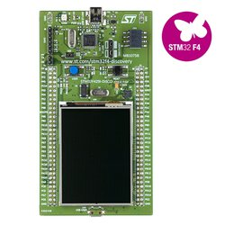

# STM32F429Discovery DTS and Peripheral Configuration Guide

This guide provides step-by-step instructions for configuring **Device Tree Source (DTS)** files and Linux kernel settings for `I2C`, `SPI`, `PWM`, `Display`, and `Serial` interfaces on the `STM32F429I-DISC1` board.

The tracked configuration is production-minimal. Kernel logging, procfs, and
debugfs are intentionally disabled to reduce the XIP image.

---

## Table of Contents
1. [Board Overview](#board-overview)
2. [Directory Structure](#directory-structure)
3. [Modifying Linux Device Tree in Buildroot](#modifying-linux-device-tree-in-buildroot)
4. [Peripheral Configuration](#peripheral-configuration)
    - [GPIO](#gpio)
    - [I2C](#i2c)
    - [SPI](#spi)
    - [Display](#display)
    - [MEM](#mem)
    - [PWM](#pwm)
    - [Serial (USART/RS-485)](#serial)
	- [Linux sleep functions](#linux-sleep-functions)
5. [Debugging a development image](#debugging-a-development-image)
6. [References](#references)
7. [License](#license)

## Board Overview

**STM32F429I-DISC1** includes:

- ST-LINK/V2-B embedded debugger/programmer
- 2.4" QVGA TFT LCD
- External 64-Mbit SDRAM
- ST MEMS gyroscope
- USB OTG micro-AB connector
- Onboard LEDs and push-buttons



### Pinout Legend


## Directory Structure

Device tree and related files are typically organized as follows:

```
firmware/
├── board/stm32f429disco/
│   ├── dts/                        ← Custom Device Tree files
│   │   ├── stm32f429disco-custom.dts
│   │   ├── overlays/               ← Optional DT overlays for peripherals
│   │   └── README.md               ← This file
│   ├── linux.config                ← Kernel configuration
│   ├── defconfigs/                 ← Buildroot configurations
│   ├── linux-patches/              ← Custom kernel patches
│   └── rootfs-overlay/             ← Root filesystem overlay
└── ...
```

## Modifying Linux Device-Tree in Buildroot

After making changes to the Device Tree:
```
# Rebuild the Linux kernel
make linux-rebuild

# Rebuild the entire system image
make
```
> **Note**: run these commands from the root of your Buildroot directory.

Or use top-level automation Makefile wrapper:

```
make dtb-rebuild
```

## Peripheral Configuration

### GPIO
This example configures the on-board LEDs and user button for user-space access:
- `ioexample1` works on LED sysfs entries (`/sys/class/leds`) to control LED triggers and brightness.
- `ioexample2` opens GPIO chips (`/dev/gpiochipX`) directly. It reads the user button on `PA0` and drives the otherwise unclaimed green LED on `PG13`.

**Test Manually via `sysfs`**:

After boot:

```bash
# List LEDs exposed via sysfs
ls /sys/class/leds

# Expected entry:
led-red
```

Manually control the red LED:

```bash
# Clear the heartbeat trigger for manual control
echo none > /sys/class/leds/led-red/trigger

# Turn LED ON
echo 1 > /sys/class/leds/led-red/brightness

# Turn LED OFF
echo 0 > /sys/class/leds/led-red/brightness
```

**Device Tree** (`stm32f429disco-custom.dts`):

```dts
. . .
	leds {
		compatible = "gpio-leds";
		led-red {
			gpios = <&gpiog 14 0>;
			linux,default-trigger = "heartbeat";
		};
	};
. . .

&gpioa {
    status = "okay";
};

&gpiog {
    status = "okay";
};
```

**Kernel Configuration** (`linux.config`)

- `CONFIG_GPIOLIB`=y: enables the GPIO subsystem allowing drivers and user-space access to GPIO lines.
- `CONFIG_GPIO_CDEV`=y: provides character device interface `/dev/gpiochipN` for advanced GPIO management.
- `CONFIG_NEW_LEDS`=y: enables the LED class framework.
- `CONFIG_LEDS_GPIO`=y: supports LEDs connected via GPIO lines.

> **Notes**:
  - Only `led-red` is registered with the LED class; `ioexample1` controls it through `/sys/class/leds/led-red`.
  - `ioexample2` uses the GPIO character-device API for `PA0` and `PG13`.
  - The button is deliberately not claimed by `gpio-keys`, and the green LED is deliberately not claimed by `gpio-leds`, so both lines remain available to `ioexample2`.

### I2C

The `STM32F429Discovery` board features `I2C3`. The minimal profile exposes the controller directly to user space for `ioexample3`; it does not enable the unused STMPE811 touchscreen stack.

**Device Tree** (`stm32f429disco-custom.dts`):

```dts
&i2c3 {
	pinctrl-names = "default";
	pinctrl-0 = <&i2c3_pins>;
	clock-frequency = <100000>;
	status = "okay";
};
```

**Kernel Configuration** (`linux.config`)

- `CONFIG_I2C`=y: enables I2C bus support in the kernel, allowing communication with I2C peripherals.
- `CONFIG_I2C_CHARDEV`=y: provides character device interface (`/dev/i2c-N`) for user-space I2C communication.
- `CONFIG_I2C_STM32F4`=y: enables STM32F4-specific I2C controller driver for hardware management of `I2C3`.


### SPI

The minimal profile exposes the onboard `L3GD20` gyroscope on `SPI5` chip select 0 as `/dev/spidev0.0` for `ioexample4`.

> **Note**:
  
  - The `"rohm,dh2228fv"` compatible string provides a `/dev/spidevX.Y` device if no dedicated driver is available.
  
  - If `"st,l3gd20-gyro"` is present and supported, the kernel will automatically bind to the `L3GD20` driver. Otherwise, `/dev/spidev*` will be exposed for testing or debugging.

The base device tree keeps the LCD and its second chip select disabled. Selecting
`BR2_PACKAGE_DISPLAY` builds the separate
`stm32f429disco-display.dtb`; `make flash` then selects that DTB automatically.
Selecting `BR2_PACKAGE_GALLERY` also builds the display DTB while leaving the
standalone Display package disabled. Gallery's default-off
`BR2_PACKAGE_GALLERY_SDCARD` built-in-support option selects
`stm32f429disco-display-sdcard.dtb`, adding the SPI4 SD-card slot.
Selecting `BR2_PACKAGE_FIRMWARE_SCREEN` instead copies the touch-enabled
`stm32f429disco-screen.dts` base under the expected display name in the kernel
build tree. Existing `*-display*.dts` compositions are reused, and the
STMPE811 at I2C3 address 0x41 is added without affecting an optional 24LC16B
at 0x50-0x57. Screen, Display, and Gallery are mutually exclusive fb0 owners.

Selecting `BR2_PACKAGE_SPINAND` appends `-spinand` to the active minimal,
Display, or USB + Display DTB. The flash shares SPI5 clock and data on
PF7/PF8/PF9 with the onboard devices and optional W5500, and uses its dedicated
PG3 chip select (`reg = <3>`). The SD adapter remains the only SPI4 device.

Selecting `BR2_PACKAGE_FIND_MY_DEVICE_FRAM` augments the active W5500 DTB with
a CY15B256Q on SPI5 chip select 4, using PG2 on P2 pin 62. It does not add a new
DTB filename: the Find My Device build hook installs either the base or
FRAM-enabled composition as `stm32f429disco-find-my-device-config.dtsi` before
the selected DTB is compiled. This keeps the minimal, Display, USB, SD, and
SPI-NAND compositions consistent without a matrix of extra filename suffixes.

Selecting `BR2_PACKAGE_FIND_MY_DEVICE_EEPROM` adds a Microchip 24LC16B to the
existing 100 kHz I2C3 bus on PA8/PC9. The `at24` driver exposes its 2 KiB
capacity through NVMEM; Find My Device uses two alternating records in the
first 512 bytes without a filesystem. EEPROM composes independently with the
base, FRAM, or SPI-NOR Find My Device device tree.

Selecting `BR2_PACKAGE_SPINOR` similarly composes a W25Q128FV on SPI5 chip
select 4 (PG2). Its first two 4 KiB erase sectors are always the raw
`find-my-device-state` partition and the remaining 16,376 KiB is the
`spinor-jffs2` partition. `BR2_PACKAGE_FIND_MY_DEVICE_SPINOR_STATE` can instead
enable only the raw W25Q device and partition, without JFFS2 or the standalone
package. The generated composition also supports simultaneous standalone SD
and SPI-NAND devices. SPI-NOR and CY15B256Q FRAM remain mutually exclusive
because both use PG2.

**Device Tree** (`stm32f429disco-custom.dts`)

```dts
&spi5 {
	status = "okay";
	pinctrl-0 = <&spi5_pins>;
	pinctrl-names = "default";
	#address-cells = <1>;
	#size-cells = <0>;
	cs-gpios = <&gpioc 1 GPIO_ACTIVE_LOW>;
    
	l3gd20: l3gd20@0 {
		/* Note: Order of compatible strings matters! Uses L3GD20 driver if available, otherwise spidev ("rohm,dh2228fv")  fallback */
		compatible = "st,l3gd20-gyro", "rohm,dh2228fv";
		/* The spidev driver ignores any unknown properties in the DT node. */
		spi-max-frequency = <1000000>;
		st,drdy-int-pin = <2>;
		interrupt-parent = <&gpioa>;
		interrupts = <1 IRQ_TYPE_EDGE_RISING>,
				<2 IRQ_TYPE_EDGE_RISING>;
		reg = <0>;
		status = "okay";
	};
};
```

**Kernel Configuration** (`linux.config`)

- `CONFIG_SPI`=y: enables SPI bus support for synchronous serial communication.
- `CONFIG_SPI_STM32`=y: provides the STM32F4 SPI controller driver.
- `CONFIG_SPI_SPIDEV`=y: exposes spidev character devices (/dev/spidevX.Y) for user-space SPI device access.

### Display

The opt-in `display` package enables the STM32 LTDC, the ILI9341 panel
on SPI5 chip select 1, DRM framebuffer emulation, `fbv`, and its PNG/JPEG/GIF
decoders. `fbv` also retains its built-in BMP support without adding a decoder
library. Its Linux settings live in `linux-display.config` rather than the
minimal `linux.config`.

The base DTS enables UART5 on PC12/PD2, which does not overlap the LCD's LTDC
signals. The display DTS includes that base and adds only the LCD nodes. The
Display package makefile adds the display DTS only for the standalone example;
the Gallery package adds either the display DTS or, when requested, the
combined Display + SD-card DTS.
Consequently, a normal build contains neither the display nodes nor the display
kernel and root-filesystem payload.

On a Display or Gallery image, `/dev/fb0` is the compatibility framebuffer
used by the display applet. See `firmware/package/readme.md` for package
selection and `firmware/package/gallery/README.md` for the composition pattern.

### MEM

This `ioexample5` demonstrates direct access to STM32F4 memory-mapped registers via `/dev/mem` using the periphery `MMIO` interface.

- It maps the RCC (Reset and Clock Control) peripheral registers into user space.
- Reads the PLL configuration registers to compute the system clock frequency (`SYSCLK`).
- Shows how to interpret PLL register fields to calculate CPU frequency based on the STM32F4 reference manual.

**Test Manually via Sysfs**:
This reads the RCC_CR register directly, but you’d still need to decode the register manually or with a script:

```bash
dd if=/dev/mem bs=4 count=1 skip=$((0x40023800/4)) 2>/dev/null | od -t x4
```

**Device Tree** (`stm32f429disco-custom.dts`)

Not needed for /dev/mem access.

**Kernel Configuration** (`linux.config`)

- `CONFIG_DEVMEM`=y: enables user-space access to physical memory through /dev/mem, allowing direct peripheral register access.

### PWM

This example configures `TIM3_CH1` on `PB4` for PWM output and allows user-space control (e.g., via the `ioexample6` application).

The onboard PG13 and PG14 LEDs cannot be driven by timer alternate functions
on STM32F429. To observe duty cycle as brightness, connect an external LED as:

```text
PB4 (TIM3_CH1) -> 330-680 ohm resistor -> LED anode
LED cathode     -> GND
```

Do not connect an LED without the series resistor.

**Test Manually via Sysfs**:

After boot:

```bash
# Check available PWM controllers
ls /sys/class/pwm

# You should see something like:
pwmchip0
```

Test PWM:

```bash
cd /sys/class/pwm/pwmchip0

# Export TIM3_CH1 (index 0)
echo 0 > export
echo 1000000 > pwm0/period       # Set period to 1,000,000 ns (1 ms)
echo 250000  > pwm0/duty_cycle   # 25% duty
echo 1 > pwm0/enable             # Enable

# Wait or observe output here...

# Disable PWM channels when done
echo 0 > pwm0/enable

# Unexport PWM channels
echo 0 > unexport
```

**Device Tree** (`stm32f429disco-custom.dts`)

```dts
&pwm3_pins {
    pins {
        pinmux = <STM32_PINMUX('B', 4, AF2)>; /* Keep only TIM3_CH1 (PB4) */
    };
};

&timers3 {
    status = "okay";
	pinctrl-names = "default";
	pinctrl-0 = <&pwm3_pins>;
    pwm {
        status = "okay";
    };
};
```

**Kernel Configuration** (`linux.config`)

- `CONFIG_PWM`=y: enables generic Pulse Width Modulation support in the kernel.
- `CONFIG_MFD_STM32_TIMERS`=y: enables the STM32 timer parent driver required by the STM32 PWM driver.
- `CONFIG_PWM_STM32`=y: STM32-specific PWM driver support for timers used as PWM controllers.
- `CONFIG_PWM_SYSFS`=y: provides sysfs interface under /sys/class/pwm for user-space control of PWM devices.
- `CONFIG_SYSFS`=y: enables the sysfs pseudo-filesystem exposing kernel objects and device attributes to user-space.

### SERIAL

This example configures UART5 on PC12 (TX, P2 pin 44) and PD2 (RX, P2 pin 40),
allowing user-space access as:

- Standard serial port → `/dev/ttySTM1`
- RS-485 mode → via `ioctl` (`TIOCSRS485`)

Example user-space apps:

- `ioexample7` → UART
- `ioexample8` → RS-485

UART5 is enabled in the shared `stm32f429disco-custom.dts`, so `/dev/ttySTM1`
is available in minimal and display images without another DTB variant. The
USART1 serial console remains enabled in every image. PC12/PD2 do not overlap
the LTDC or W5500 pins, so both UART examples can be combined with those
features. RS-485 driver-enable uses free PD4 (P2 pin 38).

**Test Manually**:

After boot:

```bash
# Check available devices
ls /dev/ttySTM*

# Expected:
/dev/ttySTM0
/dev/ttySTM1
```

Basic UART test:

```bash
stty -F /dev/ttySTM1 115200 cs8 -cstopb -parenb -ixon -ixoff -crtscts raw
echo "Hello SERIAL" > /dev/ttySTM1
```

`stty` options explained:

| Option     | Meaning                                      |
|------------|----------------------------------------------|
| `-F`       | Target device file                           |
| `115200`   | Baud rate                                    |
| `cs8`      | 8 data bits                                  |
| `-cstopb`  | 1 stop bit (`cstopb` for 2 stop bits)        |
| `-parenb`  | Disable parity (`parenb` enables parity)     |
| `-ixon`    | Disable software flow control (XON/XOFF)     |
| `-ixoff`   | Disable software flow control (receive side) |
| `-crtscts` | Disable hardware flow control                |
| `raw`      | Raw mode (no special character processing)   |


Parity/Stop Bits Quick Reference:

| Option    | Meaning                                 |
|-----------|-----------------------------------------|
| `parenb`  | Enable parity                           |
| `-parenb` | Disable parity                          |
| `parodd`  | Odd parity                              |
| `-parodd` | Even parity (default if parity enabled) |
| `cstopb`  | 2 stop bits                             |
| `-cstopb` | 1 stop bit                              |

If your driver supports RS485 mode, configure TX and RX delay times via Device Tree or configure RS485 parameters dynamically (user space app).

**Device Tree** (`stm32f429disco-custom.dts`)

> **Note**: if the DTS does not define a **serial alias** for `usart5`, the STM32 USART driver will not assign a valid device node (e.g., `/dev/ttySTM1`, `/dev/ttySTM2`).

RS-485 with DE GPIO control:
```dts
. . .
	aliases {
		serial0 = &usart1;
		serial1 = &usart5;
	};
. . .
&pinctrl {
	uart5_pins: uart5-0 {
		pins1 {
			pinmux = <STM32_PINMUX('C', 12, AF8)>; /* UART5_TX */
			bias-disable;
			drive-push-pull;
			slew-rate = <0>;
		};
		pins2 {
			pinmux = <STM32_PINMUX('D', 2, AF8)>; /* UART5_RX */
			bias-disable;
		};
	};
};

&usart5 {
	pinctrl-names = "default";
	pinctrl-0 = <&uart5_pins>;
	status = "okay";

	/* ioexample8 enables RS-485 dynamically; use PD4 for DE control. */
	rts-gpios = <&gpiod 4 GPIO_ACTIVE_HIGH>;
};
```

UART5 has no dedicated RTS/CTS pair. The STM32 serial driver toggles the
`rts-gpios` line as RS-485 DE when `ioexample8` enables RS-485 with
`TIOCSRS485`.

**Kernel Configuration** (`linux.config`)

- `CONFIG_TTY`=y: enables TTY layer support for character devices like serial ports.
- `CONFIG_SERIAL_STM32`=y: enables STM32 family serial port driver for UART/USART peripherals.
- `CONFIG_SERIAL_STM32_CONSOLE`=y: enables serial console support on STM32 serial ports, useful for kernel messages and debugging.

> **Note**: these are usually enabled if a serial console is already configured.


### Linux sleep functions

`sleepexample` (Sleep Functions Test Utility) a simple C utility designed to demonstrate and test various Linux sleep functions on embedded systems. It is especially useful for verifying kernel timer behavior and diagnosing issues where sleep functions return prematurely due to missing or misconfigured clocksource drivers.

**Features**:
- Interactive tests over a serial console.
- Demonstrates the following sleep functions:
- `sleep(seconds)`
- `usleep(microseconds)`
- `nanosleep(timespec)`
- `clock_nanosleep(clockid_t, flags, timespec)`
- Prints system date/time before and after each sleep call to verify timer accuracy.

**Why Use This Utility?**

Embedded Linux systems often face issues with kernel timers and clocksources, especially on custom or less common hardware like STM32. This utility helps to:

- Confirm that sleep and timer APIs work as expected.
- Diagnose kernel timer and tick source problems.
- Ensure the system’s high-resolution timers and clocksources are functional.

**Device Tree** (`stm32f429disco-custom.dts`)

Not needed for Linux sleep functions.

**Kernel Configuration** (`linux.config`)

Core timekeeping (mandatory for all sleep functions):

- `CONFIG_HIGH_RES_TIMERS`=y: high-resolution timers for sub-second sleeps
- `CONFIG_POSIX_TIMERS`=y: required for nanosleep() and clock_nanosleep()
- `CONFIG_GENERIC_CLOCKEVENTS`=y: basic timer interrupt handling
- `CONFIG_TICK_ONESHOT`=y: allows precise one-shot timers
- `CONFIG_HZ`=1000: recommended for millisecond accuracy
- `CONFIG_CLKSRC_STM32`=y: STM32 clocksource driver

Required for specific tests:

- `CONFIG_TIMERFD`=y: needed for timerfd_create() test
- `CONFIG_EPOLL`=y: needed for epoll_wait() test
- `CONFIG_FUTEX`=y: required by pthread_cond_timedwait() test (POSIX thread waits depend on futexes)

Real-Time Clock (RTC), hardware clock device:

- `CONFIG_RTC_CLASS`=y: enable RTC subsystem support in the Linux kernel
- `CONFIG_RTC_DRV_STM32`=y: use the STM32-specific hardware RTC driver
- `CONFIG_RTC_HCTOSYS` is not required: `sleepexample` uses `hwclock` explicitly
- `CONFIG_RTC_SYSTOHC` is not required: `sleepexample` writes the RTC explicitly

`CONFIG_SYSFS=y` remains enabled because the LED and PWM examples use it.
Procfs is not required by any packaged example.

## Debugging a development image

The production-minimal configuration does not provide kernel logs, procfs, or
debugfs. For driver development, temporarily enable `CONFIG_PRINTK`,
`CONFIG_PROC_FS`, and `CONFIG_DEBUG_FS`, and add the corresponding BusyBox
diagnostic commands. Do not carry those settings into the size-optimized image.

## References

**Device Tree Bindings and Linux Kernel Documentation**

- [Multi-Function Device (MFD) Bindings](https://www.kernel.org/doc/Documentation/devicetree/bindings/mfd/)
- [Serial Device Tree Bindings - General](https://www.kernel.org/doc/Documentation/devicetree/bindings/serial/serial.txt)
- [STM32 USART Device Tree Bindings](https://www.kernel.org/doc/Documentation/devicetree/bindings/serial/st%2Cstm32-usart.txt)
- [RS485 Device Tree Bindings (YAML)](https://www.kernel.org/doc/Documentation/devicetree/bindings/serial/rs485.yaml)
- [RS485 Driver API Documentation](https://www.kernel.org/doc/Documentation/driver-api/serial/serial-rs485.rst)

**Tutorials and Practical Guides**

- [Bootlin Embedded Linux Documentation](https://bootlin.com/docs/)
- [Bootlin Blog: Timer Counters on Linux (Microchip)](https://bootlin.com/blog/timer-counters-linux-microchip/)

**Board and Platform Specific**
- [Mbed OS: ST Discovery F429ZI Board](https://os.mbed.com/platforms/ST-Discovery-F429ZI/)
- [Modifying Linux Device Tree in Buildroot (Microchip Knowledge Base)](https://microchip.my.site.com/s/article/Modifying-Linux-Device-Tree-in-Buildroot)

## License

This repository is licensed under the MIT License. See the LICENSE file for details.
